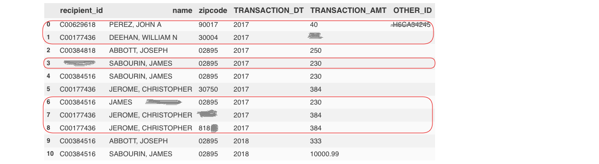

### Approach:
I used the below algorithm to develop my solution for donation analysis problem.
> **For each record in the file**:
>> **Check for INVALID conditions & ignore/ skip an entire record(line) in the file**
* we are only interested in individual contributions, we only want records that have the field, OTHER_ID, set to empty.
* If TRANSACTION_DT is an invalid date (e.g., empty, malformed).
* If ZIP_CODE is an invalid zip code (i.e., empty, fewer than five digits).
* If the NAME is an invalid name (e.g., empty, malformed).
* If any lines in the input file contains empty cells in the CMTE_ID or TRANSACTION_AMT fields.

>> **Once you get the valid record**:<br/>
>>> **Identifying repeat donors**: if a donor had previously contributed to any recipient listed in the itcont.txt file in any prior calendar year, that donor is considered a repeat donor<br/>
>>>> * **Then, catch the recipient for each donor**: if the recipient_id , zipCode & year matches i.e recipient already contributed in the prior year)<br/>
>>>> * Now, **For each record that I identified as coming from a donor who has contributed to a campaign in a prior calendar year**:
>>>>>  * Calc **running percentile** of contributions from repeat donors     
>>>>>  * Calc **total number of transactions** from repeat donors            
>>>>>  * Calc **total amount of donations** streaming in from repeat donors

##### **Assumptions**:
Federal Election Commission provides data files stretching back years and is regularly updated.(increasing order.)<br/>
##### **CATCH:**  
* Testing will be in any order of input lines.
* two contributions are from the same donor if the names and zip codes are identical.(+ any prior calendar year).
* use the combination of NAME and ZIP_CODE (again, first 5 digits) to identify a unique donor.
* you should not assume the year field holds any particular value.
* transactions noted in the input file are not in any particular order, and in fact, can be out of order chronologically.
* All lines are new so no worries about any duplicate transaction lines/entry.
* The output repeat_donors.txt file should have the only entry for repeated donors with records separator.
* TRANSCTION_AMT feild should handle both 10000.99 and 10000 as a valid transaction amounts.
* running percentile of should be rounded to the whole dollar(```<0.50$ == lower integer, >=0.50$ == Upper interger.``` )

### Dependencies:
    No major dependencies. If you have installed Conda package manager, it will pre-install everything beforehand.
### Run:
    1. run the run.sh command to check for trivial input.
    2. Uncomment the 1st line in 12th line in run.sh and comment the 8th line to execute the test case(created by me.)
**Note**: if you want to understand the flow of my code, then please uncomment the print statements in donation_analysis.py file and run the script run.sh. The print statements guide you well through the approach I have described above.

### Intial Test for directory structure and output format : Passed
    1. Running donation_analysis on input/
    ~~~~~~~~~~~~~~~~~~~~~~~~~~~~~~~~~~~~~~~~~~~~~~~~~~ Start ~~~~~~~~~~~~~~~~~~~~~~~~~~~~~~~~~~~~~~~~
    validRecordCount 6 inValidRecordCount 1
    ~~~~~~~~~~~~~~~~~~~~~~~~~~~~~~~~~~~~~~~~~~~~~~~~~~ Over ~~~~~~~~~~~~~~~~~~~~~~~~~~~~~~~~~~~~~~~~~
    [PASS]: test_1 repeat_donors.txt
    Running donation_analysis on input/
    ~~~~~~~~~~~~~~~~~~~~~~~~~~~~~~~~~~~~~~~~~~~~~~~~~~ Start ~~~~~~~~~~~~~~~~~~~~~~~~~~~~~~~~~~~~~~~~
    validRecordCount 4 inValidRecordCount 7
    ~~~~~~~~~~~~~~~~~~~~~~~~~~~~~~~~~~~~~~~~~~~~~~~~~~ Over ~~~~~~~~~~~~~~~~~~~~~~~~~~~~~~~~~~~~~~~~~
    [PASS]: your-own-test_1 repeat_donors.txt
    [Fri Feb 16 00:48:12 CST 2018] 2 of 2 tests passed

### My test case that passes the validity conditions:
 <br />

*   The invalid inputs were highlighted and removed by skip_record_validation() in donation_analysis.py script.
*   output of which is:<br/>
    C00384516|02895|2018|333|333|1<br/>
    C00384516|02895|2018|333|717|2
